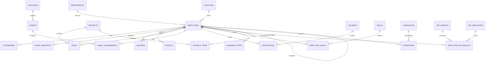

# 📊 Схема базы данных SmartOffice

## Обзор

База данных SmartOffice состоит из 25+ таблиц, организованных в 11 функциональных групп.

## Диаграмма связей (упрощённая)



## Основные таблицы

### 1. Справочники

#### positions (Должности)
```sql
position_id     SERIAL PRIMARY KEY
title           VARCHAR(100) NOT NULL UNIQUE
min_salary      DECIMAL(10,2)
max_salary      DECIMAL(10,2)
```

#### departments (Отделы)
```sql
department_id   SERIAL PRIMARY KEY
name            VARCHAR(100) NOT NULL UNIQUE
manager_id      INTEGER → employees(employee_id)
created_at      TIMESTAMP
```

#### suppliers (Поставщики)
```sql
supplier_id     SERIAL PRIMARY KEY
name            VARCHAR(200) NOT NULL UNIQUE
contact_person  VARCHAR(150)
phone           VARCHAR(20)
email           VARCHAR(100)
address         TEXT
```

#### skills (Навыки)
```sql
skill_id        SERIAL PRIMARY KEY
name            VARCHAR(100) NOT NULL UNIQUE
category        VARCHAR(100)
```

#### courses (Курсы)
```sql
course_id       SERIAL PRIMARY KEY
title           VARCHAR(300) NOT NULL UNIQUE
provider        VARCHAR(200)
duration_hours  INTEGER
description     TEXT
```

#### work_schedules (Графики работы)
```sql
schedule_id     SERIAL PRIMARY KEY
name            VARCHAR(100) NOT NULL UNIQUE
description     TEXT
monday..sunday  BOOLEAN
start_time      TIME
end_time        TIME
```

### 2. Персонал

#### employees (Сотрудники) ⭐ ЯДРО СИСТЕМЫ
```sql
employee_id         SERIAL PRIMARY KEY
personnel_number    VARCHAR(20) UNIQUE
full_name           VARCHAR(150) NOT NULL
birth_date          DATE
phone               VARCHAR(20)
email               VARCHAR(100) UNIQUE
hire_date           DATE NOT NULL
termination_date    DATE
department_id       INTEGER → departments
position_id         INTEGER → positions
manager_id          INTEGER → employees (self-reference)
schedule_id         INTEGER → work_schedules
created_at          TIMESTAMP
updated_at          TIMESTAMP
```

#### employee_addresses (Адреса)
```sql
address_id      SERIAL PRIMARY KEY
employee_id     INTEGER → employees
address_type    VARCHAR(30) (registration/residential/temporary)
country         VARCHAR(100)
region          VARCHAR(100)
city            VARCHAR(100)
street          VARCHAR(200)
house           VARCHAR(20)
apartment       VARCHAR(20)
postal_code     VARCHAR(10)
valid_from      DATE
valid_to        DATE
```

#### family_members (Члены семьи)
```sql
member_id       SERIAL PRIMARY KEY
employee_id     INTEGER → employees
full_name       VARCHAR(150)
relationship    VARCHAR(50) (spouse/child/parent/other)
birth_date      DATE
is_dependent    BOOLEAN
```

#### employee_bank_details (Банковские реквизиты)
```sql
bank_detail_id      SERIAL PRIMARY KEY
employee_id         INTEGER → employees
bank_name           VARCHAR(200)
bik                 VARCHAR(9)
account_number      VARCHAR(20)
correspondent_account VARCHAR(20)
is_default          BOOLEAN
```

### 3. Рабочее время

#### attendance (Посещаемость)
```sql
attendance_id   SERIAL PRIMARY KEY
employee_id     INTEGER → employees
work_date       DATE NOT NULL
check_in        TIMESTAMP
check_out       TIMESTAMP
hours_worked    NUMERIC(4,2) GENERATED
status          VARCHAR(20) (present/absent/vacation/sick/dayoff/remote)
```

#### leave_requests (Отпуска)
```sql
request_id      SERIAL PRIMARY KEY
employee_id     INTEGER → employees
start_date      DATE NOT NULL
end_date        DATE NOT NULL
leave_type      VARCHAR(30) (vacation/sick/unpaid/maternity/other)
status          VARCHAR(20) (pending/approved/rejected/cancelled)
approved_by     INTEGER → employees
comment         TEXT
```

#### business_trips (Командировки)
```sql
trip_id         SERIAL PRIMARY KEY
employee_id     INTEGER → employees
destination     VARCHAR(200)
start_date      DATE
end_date        DATE
purpose         TEXT
report          TEXT
status          VARCHAR(30) (planned/in_progress/completed/cancelled)
```

### 4. Проекты

#### projects (Проекты)
```sql
project_id      SERIAL PRIMARY KEY
name            VARCHAR(200) NOT NULL UNIQUE
description     TEXT
start_date      DATE
end_date        DATE
status          VARCHAR(20) (active/completed/on_hold/cancelled)
manager_id      INTEGER → employees
budget          DECIMAL(12,2)
actual_cost     DECIMAL(12,2)
```

#### tasks (Задачи)
```sql
task_id         SERIAL PRIMARY KEY
project_id      INTEGER → projects
title           VARCHAR(300)
description     TEXT
assigned_to     INTEGER → employees
deadline        DATE
priority        VARCHAR(20) (low/medium/high/critical)
estimated_hours NUMERIC(6,2)
status          VARCHAR(20) (new/in_progress/completed/blocked)
```

#### project_team (Команды проектов)
```sql
project_id      INTEGER → projects
employee_id     INTEGER → employees
role            VARCHAR(100)
joined_date     DATE
PRIMARY KEY (project_id, employee_id)
```

### 5. Финансы

#### salaries (История окладов)
```sql
salary_id       SERIAL PRIMARY KEY
employee_id     INTEGER → employees
effective_date  DATE NOT NULL
amount          DECIMAL(10,2) NOT NULL
```

#### payroll (Расчётные листы)
```sql
payroll_id      SERIAL PRIMARY KEY
employee_id     INTEGER → employees
period_start    DATE
period_end      DATE
base_salary     DECIMAL(10,2)
bonus           DECIMAL(10,2)
deductions      DECIMAL(10,2)
net_amount      DECIMAL(10,2) GENERATED
payment_date    DATE
```

### 6. Активы

#### assets (Оборудование)
```sql
asset_id        SERIAL PRIMARY KEY
name            VARCHAR(200)
type            VARCHAR(50)
serial_number   VARCHAR(100) UNIQUE
supplier_id     INTEGER → suppliers
purchase_date   DATE
purchase_price  DECIMAL(10,2)
warranty_until  DATE
status          VARCHAR(20) (available/assigned/repair/retired)
notes           TEXT
```

#### asset_assignments (Закрепление)
```sql
assignment_id       SERIAL PRIMARY KEY
asset_id            INTEGER → assets
employee_id         INTEGER → employees
assigned_date       DATE
returned_date       DATE
condition_on_return VARCHAR(100)
```

### 7. Обучение

#### certificates (Сертификаты)
```sql
certificate_id  SERIAL PRIMARY KEY
employee_id     INTEGER → employees
course_id       INTEGER → courses
issue_date      DATE
expiry_date     DATE
grade           VARCHAR(20)
verification_url VARCHAR(500)
```

#### employee_skills (Навыки сотрудников)
```sql
employee_id     INTEGER → employees
skill_id        INTEGER → skills
level           INTEGER (1-5)
PRIMARY KEY (employee_id, skill_id)
```

### 8. Рекрутинг

#### candidates (Кандидаты)
```sql
candidate_id    SERIAL PRIMARY KEY
full_name       VARCHAR(150)
birth_date      DATE
phone           VARCHAR(20)
email           VARCHAR(100) UNIQUE
position_applied INTEGER → positions
status          VARCHAR(30) (new/contacted/interviewed/offered/hired/rejected)
source          VARCHAR(100)
resume_text     TEXT
```

#### interviews (Собеседования)
```sql
interview_id    SERIAL PRIMARY KEY
candidate_id    INTEGER → candidates
employee_id     INTEGER → employees (interviewer)
interview_date  TIMESTAMP
feedback        TEXT
rating          INTEGER (1-10)
status          VARCHAR(30) (scheduled/completed/cancelled)
```

### 9. KPI

#### kpi_periods (Периоды оценки)
```sql
period_id       SERIAL PRIMARY KEY
name            VARCHAR(100)
start_date      DATE
end_date        DATE
is_active       BOOLEAN
```

#### kpi_indicators (Показатели)
```sql
indicator_id    SERIAL PRIMARY KEY
name            VARCHAR(200)
description     TEXT
unit            VARCHAR(50)
target_value    DECIMAL(10,2)
weight          DECIMAL(5,2)
```

#### employee_kpi_results (Результаты)
```sql
result_id       SERIAL PRIMARY KEY
employee_id     INTEGER → employees
period_id       INTEGER → kpi_periods
indicator_id    INTEGER → kpi_indicators
actual_value    DECIMAL(10,2)
score           DECIMAL(5,2)
```

### 10. Документы

#### documents (Файлы)
```sql
document_id     SERIAL PRIMARY KEY
file_name       VARCHAR(255)
file_path       VARCHAR(500)
mime_type       VARCHAR(100)
document_type   VARCHAR(50) (passport/diploma/contract/certificate/other)
upload_date     TIMESTAMP
```

#### employee_documents (Связь)
```sql
employee_id     INTEGER → employees
document_id     INTEGER → documents
PRIMARY KEY (employee_id, document_id)
```

### 11. Аудит

#### audit_log (Журнал изменений)
```sql
log_id          BIGSERIAL PRIMARY KEY
table_name      VARCHAR(100)
operation       VARCHAR(10) (INSERT/UPDATE/DELETE)
record_id       INTEGER
old_data        JSONB
new_data        JSONB
changed_by      INTEGER → employees
changed_at      TIMESTAMP
```

## Индексы

### Основные индексы для производительности

```sql
-- Сотрудники
CREATE INDEX idx_employees_department ON employees(department_id);
CREATE INDEX idx_employees_position ON employees(position_id);
CREATE INDEX idx_employees_manager ON employees(manager_id);
CREATE INDEX idx_employees_full_name_trgm ON employees USING gin (full_name gin_trgm_ops);

-- Посещаемость
CREATE INDEX idx_attendance_employee_date ON attendance(employee_id, work_date);

-- Задачи
CREATE INDEX idx_tasks_project ON tasks(project_id);
CREATE INDEX idx_tasks_assigned ON tasks(assigned_to);
CREATE INDEX idx_tasks_status ON tasks(status);

-- Активы
CREATE INDEX idx_asset_assignments_asset ON asset_assignments(asset_id);
CREATE INDEX idx_asset_assignments_employee ON asset_assignments(employee_id);
```

## Ограничения целостности

### CHECK ограничения
- Диапазоны зарплат: `min_salary <= max_salary`
- Даты: `start_date <= end_date`
- Рейтинги: `rating BETWEEN 1 AND 10`
- Уровни навыков: `level BETWEEN 1 AND 5`

### EXCLUDE ограничения
- Непересекающиеся отпуска для одного сотрудника
- Непересекающиеся командировки

### UNIQUE ограничения
- Табельные номера сотрудников
- Email адреса
- Серийные номера оборудования

## Триггеры

1. **update_updated_at_column** - автоматическое обновление `updated_at`
2. **generate_personnel_number** - генерация табельного номера
3. **check_termination** - проверка возможности увольнения
4. **audit_employees** - аудит изменений (опционально)

## Представления (Views)

1. **v_employee_info** - полная информация о сотрудниках
2. **v_current_salaries** - текущие оклады
3. **v_employee_task_load** - загруженность по задачам
4. **v_current_leave** - отпуска на текущий месяц
5. **v_asset_assignments** - оборудование за сотрудниками
6. **v_kpi_summary** - итоги KPI

## Статистика

```sql
-- Общее количество таблиц: 25+
-- Общее количество индексов: 50+
-- Общее количество триггеров: 4
-- Общее количество представлений: 6
-- Общее количество ограничений: 30+
```

---

**Версия схемы:** 1.0.0  
**Дата:** 28 февраля 2026
